# Cortex Deployment Scripts
This repository has the scripts for the exercises of Google Cloud Cortex Framework Tech Workshop (Tech Workshop).  The Tech Workshop familiarises participants with the following:
- Deployment of a Cloud Composer environment used by the Cortex Data Foundation
- Checking the prerequisites for deployment of Cortex Data Foundation
- Deploying the Cortex Data Foundation cloned from the open sourse Github location
- Executing preparatory steps for the deployment of Cortex Application Layer sample application

The scripts in this repository are useful for fast tracking the exercise of the Tech Workshop

Please ensure that you follow the exercise flow, in the order instructed in the workshop slide deck.  Subsequent exercises have dependencies on previous ones like granted permissions, activated API / services etc.  Skipping exercises will cause errors in later exercises.

## Prerequisites
You will need a Google Cloud DevRel dasher account user credentials to execute the exercise scripts in this repository.

At the beginning of the Tech Workshop you will receive a ticket with your user credentialsas shown below:

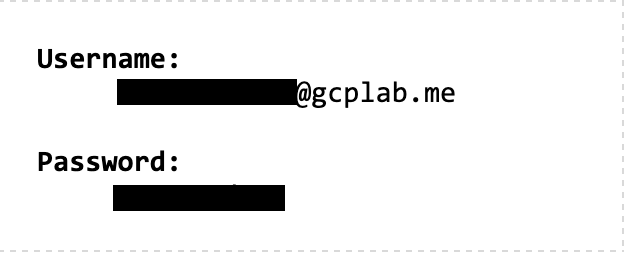

## Preparation Steps
Ensure that the following steps are completed in your Google Cloud project environment before running the actual exercise scripts.

### New Incognito Chrome Browser Window
Open a new Chrome Browser Window in Incognito mode.

### Login
Login to [Cloud Console] using the credentials in the [Prerequisites](#Prerequistes) section

Accept terms and conditions and click ```AGREE AND CONTINUE```
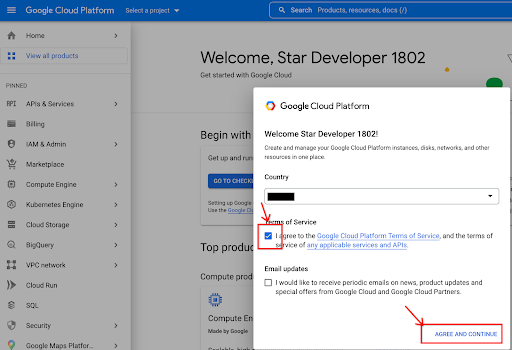

### Project Selection
Select the project (default created for you)

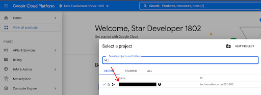

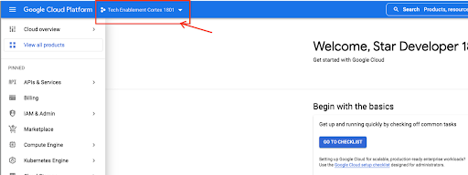

### Know your ```ProjectID```
Make a note of your project ID, that will be required in many subsequent steps and exercises.  

In case you do not have it handy, always use the dashboard of your project in the [Cloud Console] to copy ```Project ID``` value

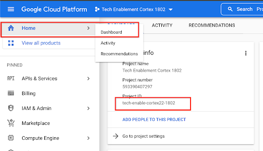

### Cloud Shell
Open Cloud Shell.

Do this by clicking  in the top bar of the [Cloud Console]

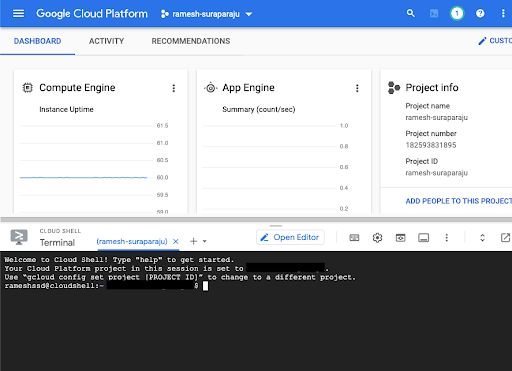

### Open Editor
Open Editor by clicking the  button in the Cloud Shell bar
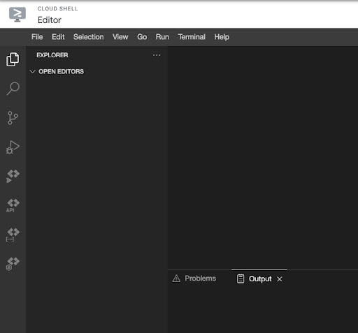

As you are using incognito mode, Cloud Shell editor will not open as 3rd party cookies are disabled in Incognito mode.

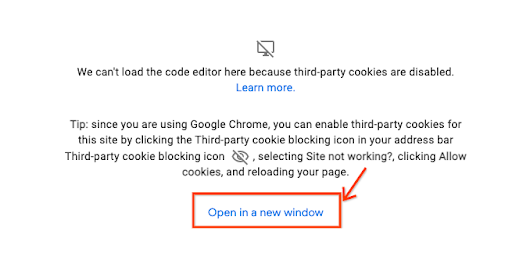

To enable it, follow the instructions below to enable third-party cookies for this site. Otherwise you can continue with the step of opening a new terminal.

Click ```Open in New Window```, Select the closed eye button in address bar

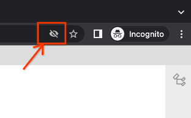

Select the ```Site not working?``` link

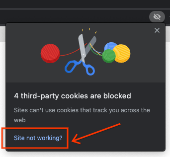

Select Allow Cookies and reload the page

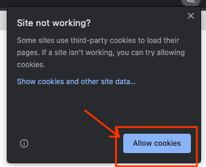

Open a new Terminal by Terminal → New Terminal

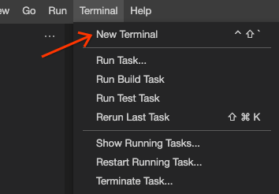

### Authorization
Run

```shell
gcloud auth list
```

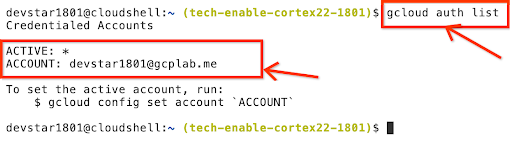

Run

```shell 
gcloud auth login --no-launch-browser
```

Open the link displayed in a separate browser tab (for example using ```Cmd+Click```)

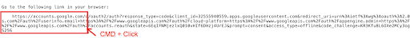

Select the account displayed (This will be the only account as you are logged in Incognito)

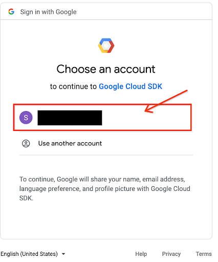

Click ```Allow```

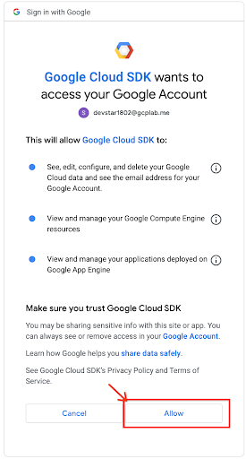

An Authorization Code will be displayed

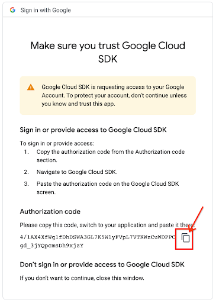

Click on the  (Copy) button

Back in the Cloud Shell Editor → Terminal window, paste the verification code that you copied (Ctrl + V / Cmd + V)

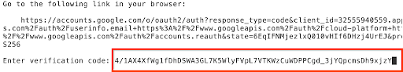

Press ```Enter```

You should be able to see output similar to the one shown at the right

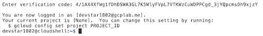

### Set Project
Ensure that you are in the right google Cloud Project by checking the Cloud Shell bash prompt

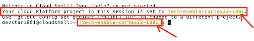

If you do not see your Project ID in the command prompt, or if you are in wrong project, use the following command to set the correct project with the following command (replace ```<PROJECT_ID>``` with the Project ID that you noted from [Know Your Project ID](#Know-your-```ProjectID```) section

```shell
gcloud config set project <PROJECT_ID>
```

### Clone scripts repo and set folder
Clone this repo into your Cloud Shell home folder

```shell
git clone https://github.com/ssdramesh/cortex-deployer-scripts
```

Change into the cloned repository folder
```shell
cd cortex-deployer-scripts
```

## Exercise 1 Create a Cloud Composer environment

If your Cloud Shell died due to a timeout (could happen during the Tech Worshop due to the time taken for each module), execute the [preparation steps](#Preparation-Steps) again.  it is important that you are properly [authorized](#Authorization), working in the right [project](#Set-Project) and are in the correct [folder](#Clone-scripts-repo-and-set-folder), before you start the exercise.  Otherwise you may get errors in script execution.

Run the script:

```shell
sh exercise1.sh
```

Follow the instructions on the terminal. Keep pressing entering to input default values as proposed.

This script will do the following:
- Enable all required APIs
- Create a VPC network for installing Cloud Composer
- Create a custom subnet
- Create a couple of basic firewall rules to make the new network accessible
- Create a User Managed Service Account (UMSA) for cortexx deployment (applicable for all exercises)
- Grant permisssions for:
    - User Managed Service Account (UMSA) to run Cloud Composer environment creation
    - User to operate as User Managed Service Account (UMSA)
- Create a Cloud Composer environment

The script triggers the creation of a Cloud Composer environment and will be run asynchronously in the background.  Creation will take about 15-20 min.

You can check the status of instance creation after ~20 min. in the [Cloud Console].

Open Cloud Console and scroll down to Composer in the hamburger menu at the top left.

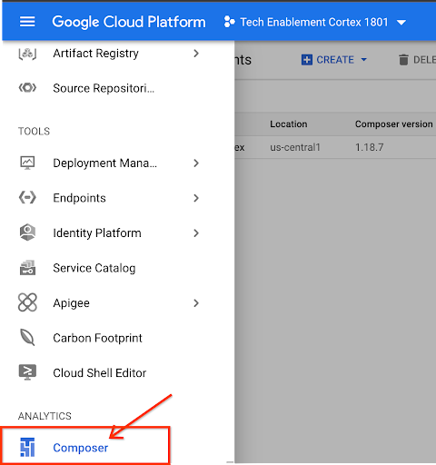

If the composer environment creation is complete, you should be able to see an instance similar to one shown on the right

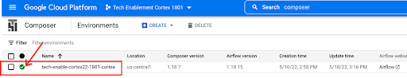

You will anyway do this at the end of exercise 3, when you need to copy the DAGHs created to the Cloud Composer DAGs bucket.

Additional Info: [Creating Environments | Cloud Composer | Google Cloud][Create Environments]

## Exercise 2 Setup BigQuery for Cortex Deployment
If your Cloud Shell died due to a timeout (could happen during the Tech Worshop due to the time taken for each module), execute the [preparation steps](#Preparation-Steps) again.  it is important that you are properly [authorized](#Authorization), working in the right [project](#Set-Project) and are in the correct [folder](#Clone-scripts-repo-and-set-folder), before you start the exercise.  Otherwise you may get errors in script execution.

Run the script for exercise 2

sh exercise2.sh

Follow the instructions on the terminal. Keep pressing entering to input default values as proposed

This script will do the following:
- Enable all required APIs for this exercise (BigQuery API)
- Grant BigQuery roles to the User Managed Service Account (UMSA) required for the deployment of Cortex Data Foundation
- Grant BigQuery roles to the Cloud Build Service Account (CBSA) required by Cloud Build to run the automated deployment of Cortex Data Foundation
- Create the datasets in your BigQuery Dataset required for deployment of Cortex Data Foundation
- Create Google Cloud Storage (GCS) buckets required for storing Airflow DAGs and logs during the deployment of Cortex Data Foundation
- Check all the prerequisites for the deployment of Cortex data Foundation

## Exercise 3 Deploy Cortex Data Foundation
If your Cloud Shell died due to a timeout (could happen during the Tech Worshop due to the time taken for each module), execute the [preparation steps](#Preparation-Steps) again.  it is important that you are properly [authorized](#Authorization), working in the right [project](#Set-Project) and are in the correct [folder](#Clone-scripts-repo-and-set-folder), before you start the exercise.  Otherwise you may get errors in script execution.

Run the script for exercise 3

```shell
sh exercise3.sh
```
Follow the instructions on the terminal. Keep pressing entering to input default values as proposed

This script will do the following:
- Clone the open source repository [Github][Cortex Data Foundation Repo] for the automated deployment of Cortex Data Foundation
- Replace the BigQuery connection ID for Airflow with the default connection ID created in [Exercise 1](#Exercise-1-Create-a-Cloud-Composer-environment) section

## Exercise 5: Configure project for Cortex Application Layer - sample application deployment
If your Cloud Shell died due to a timeout (could happen during the Tech Worshop due to the time taken for each module), execute the [preparation steps](#Preparation-Steps) again.  it is important that you are properly [authorized](#Authorization), working in the right [project](#Set-Project) and are in the correct [folder](#Clone-scripts-repo-and-set-folder), before you start the exercise.  Otherwise you may get errors in script execution.

Run the script for exercise 5

sh exercise5.sh

Follow the instructions on the terminal. Keep pressing entering to input default values as proposed

## End-to-End Deployment
Run the script for End-to-End deployment

Run the script for End-to-End Undeployment
```shell
sh deployCortexE2E.sh
```

## End-to-End "Un"deployment
Run the script for End-to-End Undeployment

```shell
sh unDeployCortexE2E.sh
```

[Cloud Console]: https://console.cloud.googlee.com
[Create Environments]: https://cloud.google.com/composer/docs/how-to/managing/creating?hl=en
[Cortex Data Foundation Repo]: https://github.com/GoogleCloudPlatform/cortex-data-foundation